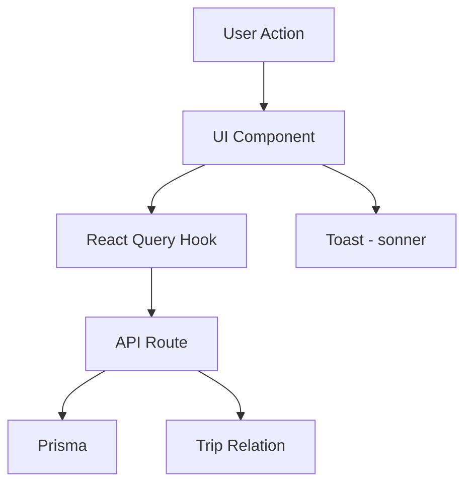

# Bookings Module Design

**Spec**: `.specs/features/bookings-module/spec.md`
**Status**: Approved

---

## Architecture Overview

O módulo de reservas segue o padrão existente no projeto: API Routes Next.js com Prisma como ORM. Novos componentes serão adicionados em `src/components/bookings/` seguindo a estrutura existente.



---

## Code Reuse Analysis

### Existing Components to Leverage

| Component | Location | How to Use |
|-----------|----------|------------|
| `Button` | `src/components/ui/button` | All action buttons |
| `Input` | `src/components/ui/input` | Form fields |
| `Card` | `src/components/ui/card` | Container cards |
| `Dialog` | `src/components/ui/dialog` | Confirmation modals |
| `Select` | `src/components/ui/select` | Dropdown selects |
| `toast` | `sonner` | Success/error feedback |
| `useTrips` | `src/hooks/api/use-travel.ts` | Fetch trips for selection |
| `authenticatedHandler` | `src/lib/api/supabase-helpers.ts` | API route protection |

### Integration Points

| System | Integration Method |
|--------|-------------------|
| Trip Model | Foreign key relation (tripId) |
| Prisma | New Booking model with relations |
| React Query | New hooks for booking CRUD |

---

## Components

### BookingForm

- **Purpose**: Form to create/edit a booking (flight or hotel)
- **Location**: `src/components/bookings/booking-form.tsx`
- **Interfaces**:
  - `booking?: Booking` - Existing booking for edit mode
  - `tripId: string` - Trip to link booking to
  - `onSubmit: (data: CreateBookingInput) => void` - Submit callback
  - `onCancel: () => void` - Cancel callback
- **Dependencies**: `useCreateBooking`, `useUpdateBooking`
- **Reuses**: Form patterns from profile page

### BookingCard

- **Purpose**: Display a single booking with key details
- **Location**: `src/components/bookings/booking-card.tsx`
- **Interfaces**:
  - `booking: Booking` - Booking data
  - `onEdit: () => void` - Edit callback
  - `onCancel: () => void` - Cancel callback
- **Dependencies**: None
- **Reuses**: Card component patterns

### BookingsList

- **Purpose**: List all bookings for a trip, grouped by type
- **Location**: `src/components/bookings/bookings-list.tsx`
- **Interfaces**:
  - `bookings: Booking[]` - List of bookings
  - `tripId: string` - Trip ID for navigation
  - `onCreateNew: () => void` - Create new booking callback
- **Dependencies**: `BookingCard`
- **Reuses**: List patterns from trips page

### BookingDetailModal

- **Purpose**: Modal to view full booking details
- **Location**: `src/components/bookings/booking-detail-modal.tsx`
- **Interfaces**:
  - `booking: Booking` - Booking data
  - `open: boolean` - Modal state
  - `onClose: () => void` - Close callback
- **Dependencies**: None
- **Reuses**: Dialog component

### CancelBookingModal

- **Purpose**: Confirmation modal for booking cancellation
- **Location**: `src/components/bookings/cancel-booking-modal.tsx`
- **Interfaces**:
  - `booking: Booking` - Booking to cancel
  - `open: boolean` - Modal state
  - `onClose: () => void` - Close callback
  - `onConfirm: () => void` - Confirm callback
- **Dependencies**: `useCancelBooking`
- **Reuses**: Dialog component patterns

---

## Data Models

### Booking (Prisma Model)

```prisma
model Booking {
  id              String    @id @default(uuid()) @db.Uuid
  tripId          String    @map("trip_id") @db.Uuid
  userId          String    @map("user_id") @db.Uuid
  type            String    // "flight" | "hotel"
  status          String    @default("confirmed") // "pending" | "confirmed" | "cancelled" | "completed"
  
  // Common fields
  confirmationCode String?  @map("confirmation_code")
  notes           String?
  
  // Flight-specific
  airline         String?
  flightNumber    String?   @map("flight_number")
  origin          String?
  destination     String?
  departureDate   DateTime? @map("departure_date")
  arrivalDate     DateTime? @map("arrival_date")
  departureTime   String?   @map("departure_time")
  arrivalTime     String?   @map("arrival_time")
  
  // Hotel-specific
  hotelName       String?   @map("hotel_name")
  hotelAddress    String?   @map("hotel_address")
  checkIn         DateTime?
  checkOut        DateTime?
  nights          Int?
  roomType        String?   @map("room_type")
  
  // Pricing
  price           Decimal?  @db.Decimal(12, 2)
  currency        String?   @default("BRL")
  
  createdAt       DateTime  @default(now()) @map("created_at")
  updatedAt       DateTime  @updatedAt @map("updated_at")
  
  trip            Trip      @relation(fields: [tripId], references: [id], onDelete: Cascade)
  
  @@map("bookings")
}
```

### Trip (Extended)

```prisma
model Trip {
  // ... existing fields ...
  bookings        Booking[]
}
```

### Booking TypeScript Interface

```typescript
interface Booking {
  id: string
  tripId: string
  userId: string
  type: 'flight' | 'hotel'
  status: 'pending' | 'confirmed' | 'cancelled' | 'completed'
  confirmationCode?: string
  notes?: string
  
  // Flight fields
  airline?: string
  flightNumber?: string
  origin?: string
  destination?: string
  departureDate?: string
  arrivalDate?: string
  departureTime?: string
  arrivalTime?: string
  
  // Hotel fields
  hotelName?: string
  hotelAddress?: string
  checkIn?: string
  checkOut?: string
  nights?: number
  roomType?: string
  
  // Pricing
  price?: number
  currency?: string
  
  createdAt: string
  updatedAt: string
}
```

---

## Error Handling Strategy

| Error Scenario | Handling | User Impact |
|----------------|----------|-------------|
| Booking creation fails | Show error toast | "Erro ao criar reserva. Tente novamente." |
| Booking update fails | Show error toast | "Erro ao atualizar reserva." |
| Booking cancellation fails | Show error toast | "Erro ao cancelar reserva." |
| Invalid dates | Show validation error | "Datas inválidas." |
| Trip not found | Return 404 | "Viagem não encontrada." |

---

## Risks & Concerns

| Concern | Location | Impact | Mitigation |
|---------|----------|--------|------------|
| No Trip relation in current schema | `prisma/schema.prisma` | Cannot link bookings to trips | Add Booking model with foreign key |
| Dual flight search APIs | `src/app/api/flights/` | Inconsistent data sources | Standardize on one API for booking creation |
| No payment tracking | `src/types/shared.ts` | Cannot track actual spending | Add optional price field to Booking |

---

## Tech Decisions

| Decision | Choice | Rationale |
|----------|--------|-----------|
| Single Booking model | Unified model with type field | Simpler than separate FlightBooking/HotelBooking models |
| Status as string | Not enum | Flexibility for future status values |
| Cascade delete | Trip deletion removes bookings | Data consistency |
| Optional price | Price field nullable | User may not remember exact price |

> **Project-level decisions:** None new — all decisions are feature-local.
