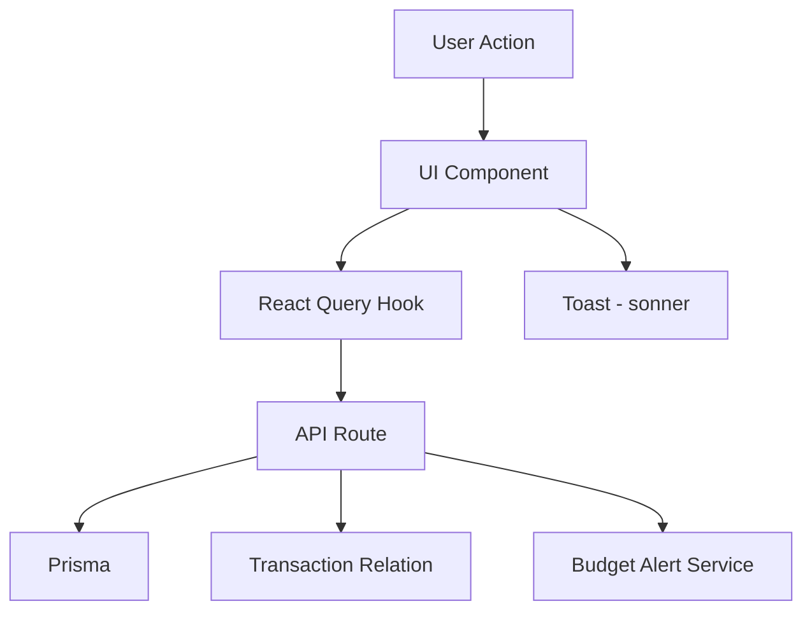

# Budget Module Design

**Spec**: `.specs/features/budget-module/spec.md`
**Status**: Approved

---

## Architecture Overview

O módulo de orçamento segue o padrão existente no projeto: API Routes Next.js com Prisma como ORM. Integra-se com o módulo Finance existente para calcular gastos reais por categoria.



---

## Code Reuse Analysis

### Existing Components to Leverage

| Component | Location | How to Use |
|-----------|----------|------------|
| `Button` | `src/components/ui/button` | All action buttons |
| `Input` | `src/components/ui/input` | Form fields |
| `Card` | `src/components/ui/card` | Container cards |
| `Progress` | `src/components/ui/progress` | Budget progress bars |
| `toast` | `sonner` | Success/error feedback |
| `useTransactions` | `src/hooks/api/use-finance.ts` | Fetch transactions for spending calculation |
| `authenticatedHandler` | `src/lib/api/supabase-helpers.ts` | API route protection |

### Integration Points

| System | Integration Method |
|--------|-------------------|
| Transaction Model | Query transactions by category and date range |
| Finance Module | Reuse categories from existing finance module |
| React Query | New hooks for budget CRUD |

---

## Components

### BudgetForm

- **Purpose**: Form to create/edit a budget category with limit
- **Location**: `src/components/budget/budget-form.tsx`
- **Interfaces**:
  - `budget?: Budget` - Existing budget for edit mode
  - `month: number` - Target month
  - `year: number` - Target year
  - `onSubmit: (data: CreateBudgetInput) => void` - Submit callback
  - `onCancel: () => void` - Cancel callback
- **Dependencies**: `useCreateBudget`, `useUpdateBudget`
- **Reuses**: Form patterns from booking-form

### BudgetCard

- **Purpose**: Display a single budget category with progress
- **Location**: `src/components/budget/budget-card.tsx`
- **Interfaces**:
  - `budget: BudgetWithSpent` - Budget data with spent amount
  - `onEdit: () => void` - Edit callback
  - `onDelete: () => void` - Delete callback
- **Dependencies**: None
- **Reuses**: Progress component

### BudgetOverview

- **Purpose**: Dashboard showing all budgets with summary
- **Location**: `src/components/budget/budget-overview.tsx`
- **Interfaces**:
  - `budgets: BudgetWithSpent[]` - List of budgets with spent
  - `totalBudget: number` - Total budget amount
  - `totalSpent: number` - Total spent amount
- **Dependencies**: `BudgetCard`
- **Reuses**: Card component patterns

### BudgetAlertBanner

- **Purpose**: Show alerts when approaching budget limits
- **Location**: `src/components/budget/budget-alert-banner.tsx`
- **Interfaces**:
  - `alerts: BudgetAlert[]` - List of active alerts
  - `onDismiss: (id: string) => void` - Dismiss callback
- **Dependencies**: None
- **Reuses**: Alert patterns

### BudgetHistory

- **Purpose**: Show historical budget data
- **Location**: `src/components/budget/budget-history.tsx`
- **Interfaces**:
  - `history: BudgetHistoryItem[]` - Historical data
  - `onSelectMonth: (month: number, year: number) => void` - Month selection
- **Dependencies**: None
- **Reuses**: Table/list patterns

---

## Data Models

### Budget (Prisma Model)

```prisma
model Budget {
  id          String   @id @default(uuid()) @db.Uuid
  userId      String   @map("user_id") @db.Uuid
  category    String
  limit       Decimal  @db.Decimal(12, 2)
  month       Int
  year        Int
  createdAt   DateTime @default(now()) @map("created_at")
  updatedAt   DateTime @updatedAt @map("updated_at")

  @@unique([userId, category, month, year])
  @@map("budgets")
}
```

### Budget TypeScript Interface

```typescript
interface Budget {
  id: string
  userId: string
  category: string
  limit: number
  month: number
  year: number
  createdAt: string
  updatedAt: string
}

interface BudgetWithSpent extends Budget {
  spent: number
  remaining: number
  percentage: number
  status: 'safe' | 'warning' | 'danger'
}

interface CreateBudgetInput {
  category: string
  limit: number
  month: number
  year: number
}

interface BudgetAlert {
  id: string
  category: string
  type: 'warning' | 'danger'
  message: string
  createdAt: string
}

interface BudgetHistoryItem {
  month: number
  year: number
  totalBudget: number
  totalSpent: number
  categories: {
    category: string
    budget: number
    spent: number
  }[]
}
```

---

## Error Handling Strategy

| Error Scenario | Handling | User Impact |
|----------------|----------|-------------|
| Budget creation fails | Show error toast | "Erro ao criar orçamento." |
| Budget update fails | Show error toast | "Erro ao atualizar orçamento." |
| Budget deletion fails | Show error toast | "Erro ao excluir orçamento." |
| Duplicate category | Update existing budget | "Orçamento atualizado com sucesso." |
| Invalid limit | Show validation error | "Limite deve ser maior que zero." |

---

## Risks & Concerns

| Concern | Location | Impact | Mitigation |
|---------|----------|--------|------------|
| No Budget model in schema | `prisma/schema.prisma` | Cannot store budgets | Add Budget model |
| Transaction categories not standardized | `src/types/shared.ts` | Inconsistent category names | Use existing categories from finance module |
| Performance on large transaction sets | `src/app/api/budget/` | Slow spending calculation | Index on category and date; cache calculations |

---

## Tech Decisions

| Decision | Choice | Rationale |
|----------|--------|-----------|
| Budget per month | Monthly granularity | Most common budgeting pattern |
| Unique constraint on user+category+month+year | Prevents duplicates | Data integrity |
| Spending calculated from transactions | Real-time calculation | Always accurate |
| Alerts stored in state | Not persisted | Simple, no DB overhead |

> **Project-level decisions:** None new — all decisions are feature-local.
