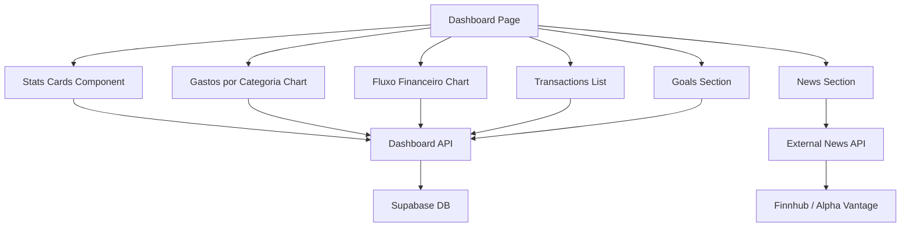

# Dashboard Redesign Design

**Spec**: `.specs/features/dashboard-redesign/spec.md`
**Status**: Draft

---

## Architecture Overview

The redesign focuses on the frontend dashboard page (`apps/web/src/app/(app)/dashboard/page.tsx`). The backend API route (`apps/web/src/app/api/dashboard/route.ts`) needs minor enhancements to provide more granular data for charts.



---

## Code Reuse Analysis

### Existing Components to Leverage

| Component | Location | How to Use |
|-----------|----------|------------|
| Card, CardContent, CardHeader | `src/components/ui/card.tsx` | Continue using for all card containers |
| Button | `src/components/ui/button.tsx` | Continue using for all buttons |
| Recharts components | Already imported | Extend with new chart types |
| Framer Motion | Already imported | Continue using for animations |
| useDashboard hook | `src/hooks/api/use-dashboard.ts` | Extend to fetch additional data |
| phantom-card CSS class | `src/styles/globals.css` | Use for card styling |

### Integration Points

| System | Integration Method |
|--------|-------------------|
| Dashboard API | Extend response with category breakdown and monthly trends |
| External News API | New API route `/api/news/external` for Finnhub/Alpha Vantage |
| Supabase | Existing queries, no schema changes needed |

---

## Components

### StatsHero Component

- **Purpose**: Display key financial metrics in a prominent hero section
- **Location**: `src/components/dashboard/stats-hero.tsx` (new)
- **Interfaces**:
  - `StatsHeroProps`: `{ totalPatrimony: number; monthlyIncome: number; monthlyExpenses: number; balance: number }`
- **Dependencies**: Card components, Recharts for mini sparklines
- **Reuses**: Card components, formatCurrency utility

### CategoryChart Component

- **Purpose**: Display expense breakdown by category in a donut chart
- **Location**: `src/components/dashboard/category-chart.tsx` (new)
- **Interfaces**:
  - `CategoryChartProps`: `{ data: CategoryData[]; loading: boolean }`
  - `CategoryData`: `{ name: string; value: number; percentage: number; color: string }`
- **Dependencies**: Recharts PieChart
- **Reuses**: Card components, formatCurrency utility

### CashFlowChart Component

- **Purpose**: Display income vs expenses trend over time
- **Location**: `src/components/dashboard/cash-flow-chart.tsx` (new)
- **Interfaces**:
  - `CashFlowChartProps`: `{ data: CashFlowData[]; loading: boolean }`
  - `CashFlowData`: `{ month: string; income: number; expenses: number }`
- **Dependencies**: Recharts AreaChart
- **Reuses**: Card components, formatCurrency utility

### NewsSection Component

- **Purpose**: Display financial news from external API
- **Location**: `src/components/dashboard/news-section.tsx` (new)
- **Interfaces**:
  - `NewsSectionProps`: `{ news: NewsItem[]; loading: boolean; onRefresh: () => void }`
  - `NewsItem`: `{ title: string; source: string; date: string; url: string; summary: string }`
- **Dependencies**: External news API
- **Reuses**: Card components, ExternalLink icon

---

## Data Models

### CategoryData

```typescript
interface CategoryData {
  name: string
  value: number
  percentage: number
  color: string
}
```

### CashFlowData

```typescript
interface CashFlowData {
  month: string
  income: number
  expenses: number
}
```

### DashboardStats (extended)

```typescript
interface DashboardStats {
  totalPatrimony: number
  monthlyIncome: number
  monthlyExpenses: number
  balance: number
  savingsRate: number
  categoryBreakdown: CategoryData[]
  cashFlowTrend: CashFlowData[]
}
```

---

## Error Handling Strategy

| Error Scenario | Handling | User Impact |
|----------------|----------|-------------|
| News API fails | Fallback to cached data or Google News RSS | Shows "Últimas notícias" with available data |
| Chart data empty | Show empty state with illustration | User sees "Sem dados disponíveis" |
| API timeout | Show cached data with refresh button | User can retry manually |
| Network offline | Show last cached state | User sees stale but functional data |

---

## Risks & Concerns

| Concern | Location | Impact | Mitigation |
|---------|----------|--------|------------|
| External API rate limits | `src/app/api/news/external/route.ts` | News section may fail | Cache responses, fallback to Google News RSS |
| Large dataset performance | `src/components/dashboard/cash-flow-chart.tsx` | Slow rendering with 1000+ transactions | Aggregate data server-side before sending |
| Chart responsiveness | Multiple chart components | Charts may not render well on mobile | Use ResponsiveContainer from Recharts |

---

## Tech Decisions

| Decision | Choice | Rationale |
|----------|--------|-----------|
| News API | Finnhub (free tier) | 60 calls/min, financial news focus, no CORS issues |
| Chart library | Recharts (existing) | Already in project, consistent |
| Animation | Framer Motion (existing) | Already in project, consistent |
| Component structure | Extract to separate files | Better organization, easier to maintain |
| Data fetching | Extend existing useDashboard hook | Single data source, less complexity |

---

## Implementation Approach

1. **Phase 1**: Extend dashboard API to provide category breakdown and monthly cash flow data
2. **Phase 2**: Create extracted chart components (CategoryChart, CashFlowChart, StatsHero)
3. **Phase 3**: Create external news API route with Finnhub integration
4. **Phase 4**: Redesign main dashboard page with new layout and components
5. **Phase 5**: Add animations and polish

---

## Visual Design Direction

### Color Palette (extending existing)

- Primary: Purple/Violet (`#818cf8`, `#6366f1`)
- Success: Green (`#4ade80`)
- Danger: Red (`#f87171`)
- Neutral: Gray scale for backgrounds

### Typography

- Headings: Inter (already in use)
- Body: Inter (already in use)

### Card Design

- Rounded corners (16px)
- Subtle borders with transparency
- Hover elevation effects
- Gradient accents for key metrics

### Chart Design

- Donut chart with center label showing total
- Area chart with gradient fill for income/expenses
- Consistent color scheme across all charts
- Tooltips with formatted currency values
