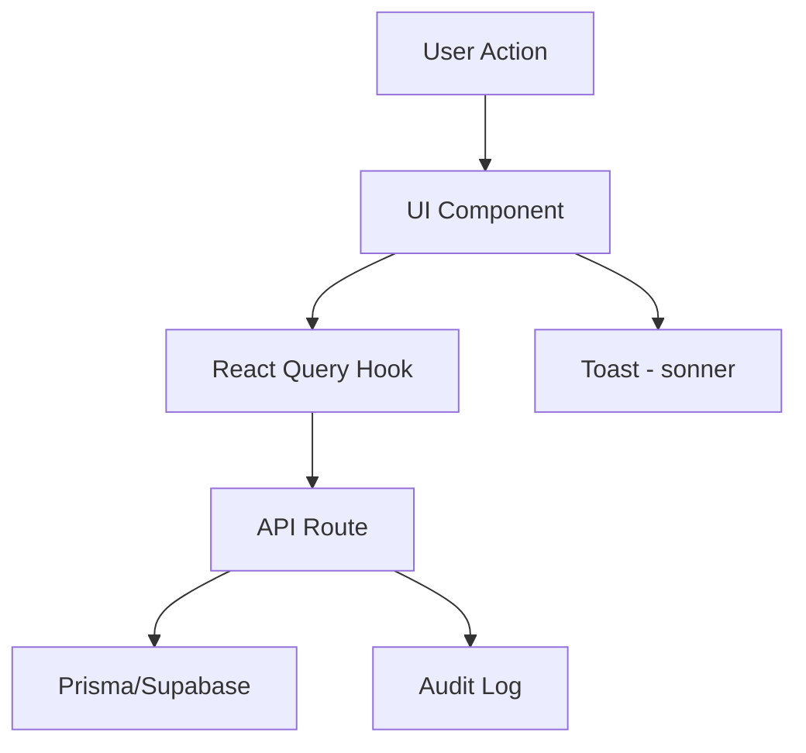

# User Module Design

**Spec**: `.specs/features/user-module/spec.md`
**Status**: Approved

---

## Architecture Overview

O módulo de usuário segue o padrão existente no projeto: API Routes no Next.js com Prisma como ORM e Supabase para auth. Novos componentes serão adicionados em `src/components/user/` seguindo a estrutura existente.



---

## Code Reuse Analysis

### Existing Components to Leverage

| Component | Location | How to Use |
|-----------|----------|------------|
| `Button` | `src/components/ui/button` | All action buttons |
| `Input` | `src/components/ui/input` | Form fields |
| `Card` | `src/components/ui/card` | Container cards |
| `Dialog` | `src/components/ui/dialog` | Confirmation modals |
| `toast` | `sonner` | Success/error feedback |
| `useProfile` | `src/hooks/api/use-profile.ts` | Profile data fetching |
| `authenticatedHandler` | `src/lib/api/supabase-helpers.ts` | API route protection |

### Integration Points

| System | Integration Method |
|--------|-------------------|
| Supabase Auth | `supabase.auth.admin.deleteUser()` for account deletion |
| Prisma | Profile model with new fields |
| Audit Log | Log all sensitive operations |

---

## Components

### UserAvatar

- **Purpose**: Reusable avatar component with image or initials fallback
- **Location**: `src/components/user/user-avatar.tsx`
- **Interfaces**:
  - `src: string | null` - Avatar URL
  - `name: string` - User name for initials fallback
  - `size: 'sm' | 'md' | 'lg'` - Avatar size
- **Dependencies**: `@/components/ui/avatar`
- **Reuses**: shadcn Avatar component

### UserProfileCard

- **Purpose**: Display user profile summary with name, email, plan badge
- **Location**: `src/components/user/profile-card.tsx`
- **Interfaces**:
  - `profile: ProfileData` - Profile data
  - `onEdit?: () => void` - Edit callback
- **Dependencies**: `UserAvatar`, `useProfile`
- **Reuses**: `UserAvatar`, Card component

### AccountSettings

- **Purpose**: Account management panel with delete, export, email change
- **Location**: `src/components/user/account-settings.tsx`
- **Interfaces**:
  - `onAccountDeleted?: () => void` - Callback after deletion
- **Dependencies**: `useDeleteAccount`, `useExportData`, `useChangeEmail`
- **Reuses**: Dialog, Button, toast

### DeleteAccountModal

- **Purpose**: Confirmation modal for account deletion
- **Location**: `src/components/user/delete-account-modal.tsx`
- **Interfaces**:
  - `open: boolean` - Modal state
  - `onClose: () => void` - Close callback
  - `onConfirm: () => void` - Confirm callback
- **Dependencies**: Dialog, Input
- **Reuses**: Dialog component

### ExportDataModal

- **Purpose**: Modal to request and download data export
- **Location**: `src/components/user/export-data-modal.tsx`
- **Interfaces**:
  - `open: boolean` - Modal state
  - `onClose: () => void` - Close callback
- **Dependencies**: `useExportData`
- **Reuses**: Dialog, Button

---

## Data Models

### Profile (Extended)

```typescript
interface Profile {
  id: string
  name: string | null
  email: string | null
  phone: string | null
  birthDate: Date | null
  avatarUrl: string | null
  // New fields
  emailVerified: boolean
  accountStatus: 'active' | 'deleted' | 'suspended'
  deletedAt: Date | null
  createdAt: Date
  updatedAt: Date
}
```

### AccountDeletionRequest

```typescript
interface AccountDeletionRequest {
  id: string
  userId: string
  reason?: string
  requestedAt: Date
  scheduledFor: Date  // 30 days from request
  status: 'pending' | 'completed' | 'cancelled'
}
```

### DataExportLog

```typescript
interface DataExportLog {
  id: string
  userId: string
  requestedAt: Date
  completedAt?: Date
  downloadUrl?: string
  expiresAt: Date
}
```

---

## Error Handling Strategy

| Error Scenario | Handling | User Impact |
|----------------|----------|-------------|
| Account deletion fails | Show error toast, log to audit | "Erro ao excluir conta. Tente novamente." |
| Export generation fails | Show error toast, retry option | "Erro ao gerar exportação. Tente novamente." |
| Email already in use | Return 409 Conflict | "Este email já está em uso." |
| Invalid current password | Return 401 Unauthorized | "Senha incorreta." |
| Session expired | Redirect to login | "Sessão expirada. Faça login novamente." |

---

## Risks & Concerns

| Concern | Location | Impact | Mitigation |
|---------|----------|--------|------------|
| No soft delete in Profile model | `prisma/schema.prisma` | Cannot recover deleted accounts | Add `deletedAt` and `accountStatus` fields |
| No audit trail for sensitive ops | `src/app/api/` | Cannot track who did what | Create AuditLog entries for all operations |
| Avatar upload uses raw fetch | `src/app/(app)/profile/page.tsx` | Inconsistent with React Query pattern | Refactor to use `useMutation` hook |
| No rate limiting on email change | `src/app/api/settings/` | Could spam confirmation emails | Add rate limiting middleware |

---

## Tech Decisions

| Decision | Choice | Rationale |
|----------|--------|-----------|
| Soft delete for accounts | 30-day retention | LGPD compliance + user recovery |
| JSON export format | Standard JSON | Easy to parse, widely supported |
| Email change via confirmation link | Supabase built-in | Security best practice |
| Admin user list | Prisma pagination | Handles large user bases |

> **Project-level decisions:** None new — all decisions are feature-local.
